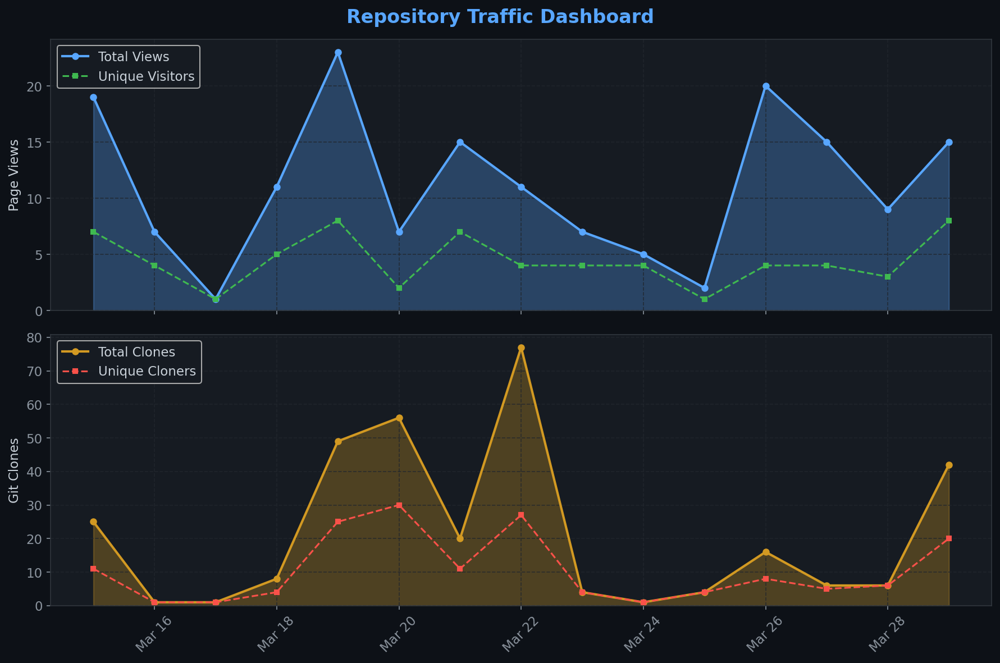
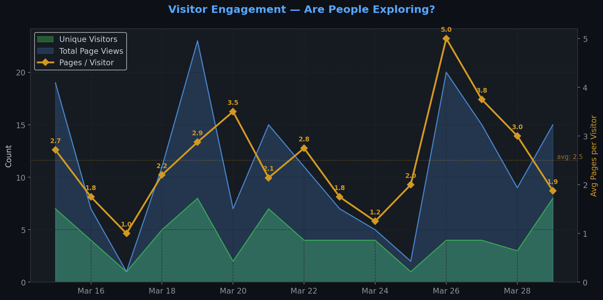
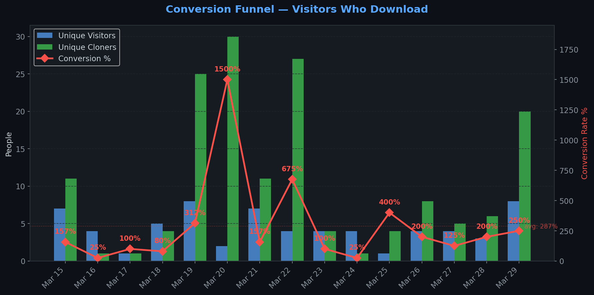
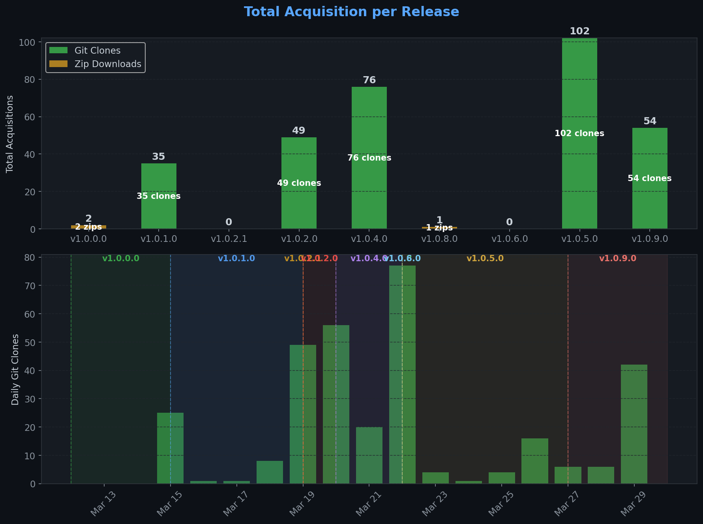
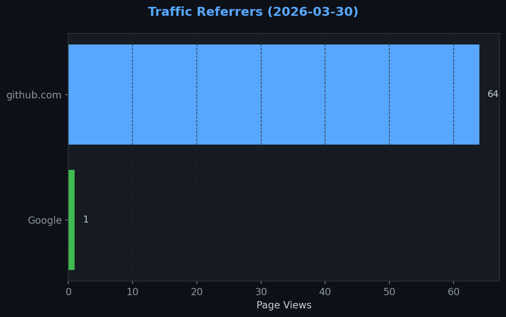
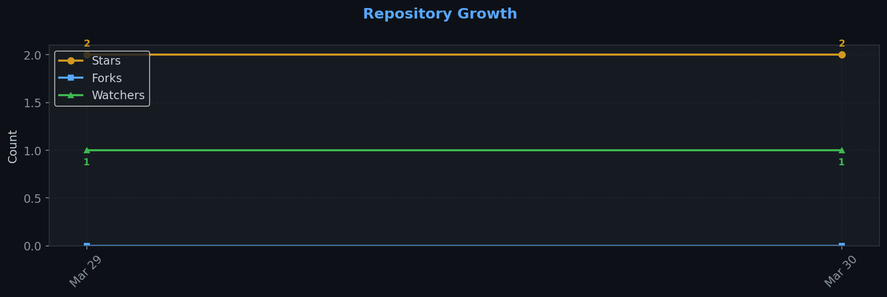

# Repository Traffic Dashboard

**Last updated:** 2026-03-30T18:59:56Z
**Days tracked:** 2 | **Download snapshots:** 4 (hourly)

---

## Views & Clones (14-day window, preserved forever)

| Metric | 14-Day Total | Unique |
|--------|-------------|--------|
| Page Views | 148 | 39 |
| Git Clones | 291 | 127 |

> **Engagement:** 3.7 pages per visitor (14-day avg)

---

## Visitor Engagement

> Higher = visitors exploring more pages. 1.0 = bounce. 3.0+ = deeply engaged.

---

## Conversion Funnel

> **14-day conversion:** 130 of 39 visitors cloned or downloaded (**333.3%**)
>
> Unique cloners: 127 | Release downloads: 3

---

## Total Acquisition per Release (Downloads + Clones)

| Channel | Count |
|---------|-------|
| Zip Downloads | 3 |
| Git Clones (14-day) | 291 |
| **Total Acquisitions** | **294** |

---

## Referrers

| Source | Views | Unique |
|--------|-------|--------|
| github.com | 64 | 22 |
| Google | 1 | 1 |

---

## Repository Growth

| Metric | Current |
|--------|---------|
| Stars | 2 |
| Forks | 0 |
| Watchers | 1 |

---

## Top Pages (14-day)

| Page | Views | Unique |
|------|-------|--------|
| `/TheCodingDad-TisonK/FS25_WorkplaceTriggers` | 61 | 25 |
| `/TheCodingDad-TisonK/FS25_WorkplaceTriggers/releases/tag/v1.0.9.0` | 10 | 4 |
| `/TheCodingDad-TisonK/FS25_WorkplaceTriggers/releases` | 9 | 6 |
| `/TheCodingDad-TisonK/FS25_WorkplaceTriggers/issues/7` | 8 | 6 |
| `/TheCodingDad-TisonK/FS25_WorkplaceTriggers/issues` | 8 | 4 |
| `/TheCodingDad-TisonK/FS25_WorkplaceTriggers/pulls` | 6 | 5 |
| `/TheCodingDad-TisonK/FS25_WorkplaceTriggers/releases/tag/v1.0.8.0` | 6 | 2 |
| `/TheCodingDad-TisonK/FS25_WorkplaceTriggers/releases/tag/v1.0.2.1` | 3 | 2 |
| `/TheCodingDad-TisonK/FS25_WorkplaceTriggers/issues/17` | 2 | 2 |
| `/TheCodingDad-TisonK/FS25_WorkplaceTriggers/issues/new` | 2 | 2 |

---

## Data Files

| File | Description | Granularity |
|------|-------------|-------------|
| [daily.json](daily.json) | Views & clones per day (never expires) | Daily |
| [downloads.json](downloads.json) | Release download snapshots | Hourly |
| [referrers.json](referrers.json) | Referrer snapshots | Daily |
| [metadata.json](metadata.json) | Stars, forks, watchers | Daily |
| [stats.json](stats.json) | Combined legacy snapshots | 6-hourly |

---
*Hourly download tracking + full dashboard with engagement metrics every 6 hours*
*Auto-generated by [traffic-stats.yml](../../.github/workflows/traffic-stats.yml)*
